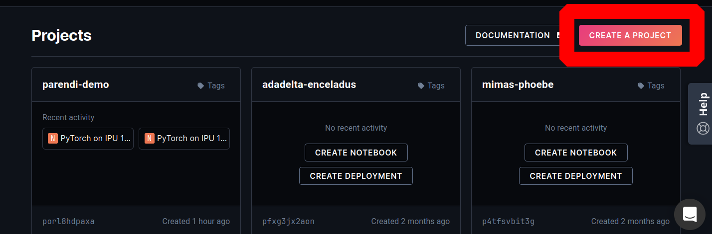
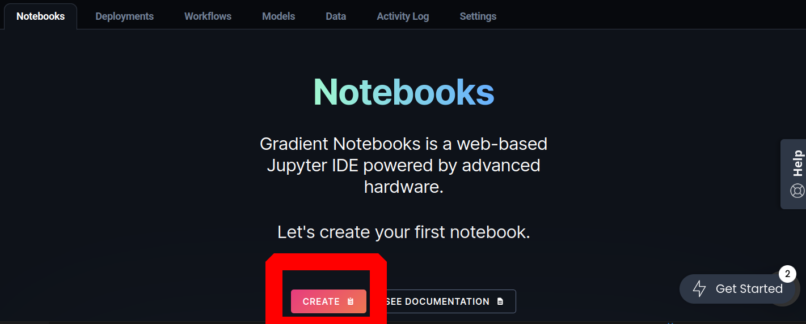
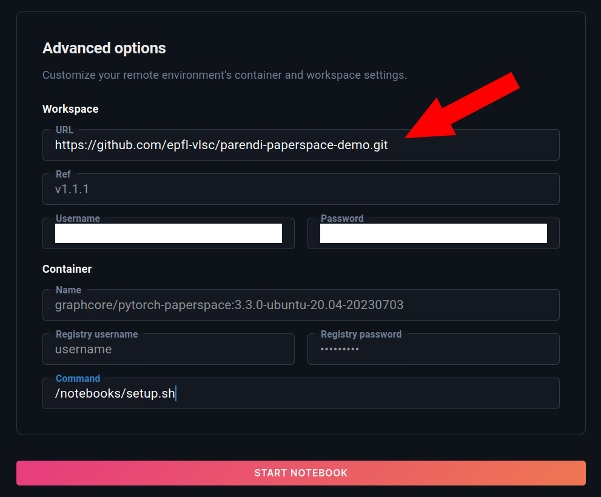
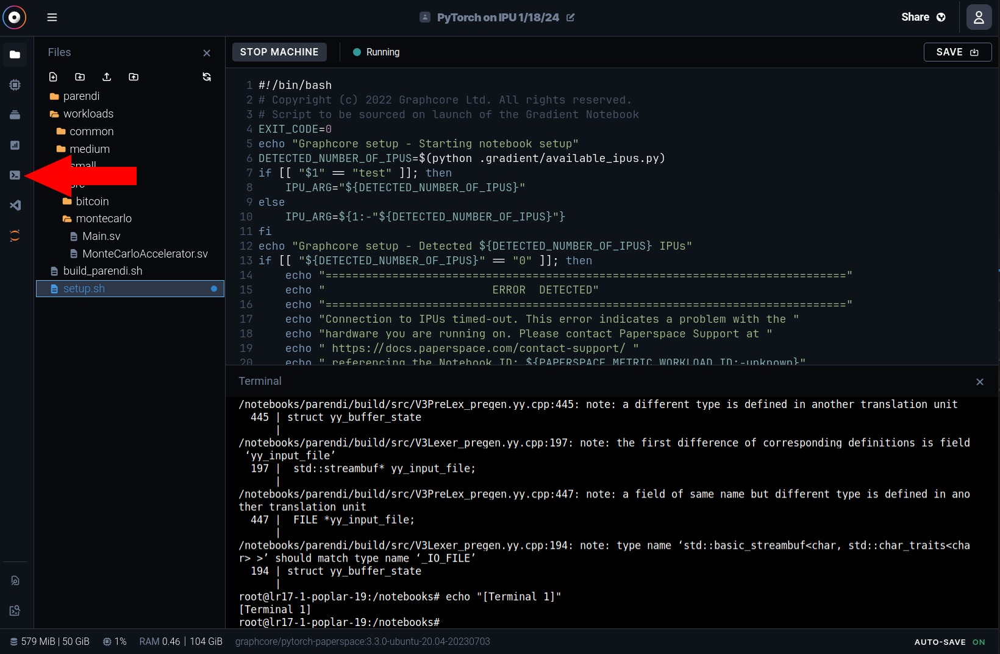

# Creating an IPU Instance

Follow the steps below

    <em>Step 1: Log into your paperspace account and create a project</em>
    

<br\>

    <em>Step 2: Create a notebook</em>
    

    <em>Step 3: Select the "Pytorch on IPU" instance</em>
    

<br\>

    <em>Step 4: Change the workspace URL to:
     https://github.com/epfl-vlsc/parendi-paperspace-demo.git 
    and start the notebook</em>
    

<br\>

    <em>Step 5: open up a new terminal using the button on the left.</em>
    

