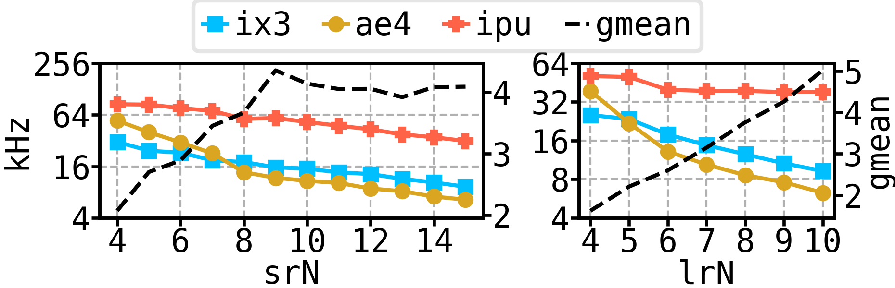
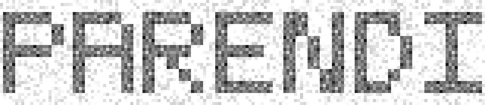

# Parendi demo on Paperspace Cloud IPUs
You need a [Paperspace](https://paperspace.com) account to follow this demo.
You can use an M2000 machine with 4 IPUs for free for 6 hours, and this demo should take less than that. Follow [this](paperspace.md) guide to creating an IPU instance.
## Building Parendi
Open a terminal in your Paperspace instance and build Parendi using the following command:
```bash
./build_parendi.sh
```
This should take a few minutes.

## Running an example

Let us simulate a small design: a bitcoin miner. Its source files are located in [`workloads/src/bitcoin`](workloads/src/bitcoin/). You can simulate by doing the following:
```bash
cd workloads/small/bitcoin
# build it with Parendi, TILES is optional
make build_ipu TILES=300
# run it for up to 1B cycles
./obj_dir_nocfg_ipu_300_1_noflag/VMain +max-cycles=100000000 +nocheck

```
You should get the following output:
```bash
@   10502607 00a0414b 00a041cf
*-* All Finished *-*
- ../../..//workloads/src/bitcoin/Main.v:37: Verilog $finish
```
The binary files generated in this repository follow this pattern:
```
obj_dir_${CONFIG}_ipu_${TILES}_${WORKERS}_${FLAGS}/VMain
```
Most of them also accept a `+max-cycles` argument, in case you want to run to evaluate performance rather than check the result quickly.
The runtime measure simulation time for you in a `VMain___024root_runtime` file inside the object directory, for instance:
```
$ cat obj_dir_nocfg_ipu_1472_1_noflag/VMain___024root_runtime.log
load:        0.553167s
init 0
        wall:        0.002733s
run 0
        wall:       11.224360s
sim: 11.227976s
all: 11.784211s
```
There is also a bunch of compilation stats:
```
less obj_dir_nocfg_ipu_1472_1_noflag/VMain__stats.txt
```

## Multi-IPU Simulation
You can run other simulations; they are categorized based on their size.
In case you want to run a multi-IPU simulation, you need to set the `TILE` variable when calling `make`:

```bash
cd workloads/medium/montecarlo
make build_ipu TILES=2944 # two IPUs
./obj_dir_nocfg_ipu_2944_1_noflag/VMain +max-cycles=1000000
```


You can also pass extra flags to Parendi with `EXTRA_IPU_FLAGS`
```bash
make build_ipu TILES=2944 EXTRA_IPU_FLAGS='-fno-inter-ipu-comm'
```
This disables multi-IPU communication optimization and unsurprisingly makes simulation run slower.
TODO: give a list of all the possible flags and optimizations.

# Simulating Rocket SoCs

You may notice that in the Montecarlo benchmark, using 2 IPUs yields worse performance than a single one.
This design is not large enough to require multiple IPUs.

Do not worry though, we have just the right examples that actually benefit from multiple IPUs.
```bash
cd workloads/large/rocket
make build_ipu TILES=2944 ROCKET_CONFIG=BigRocket10x10CoreMeshConfig
./obj_dir_BigRocket2x2CoreMeshConfig_ipu_2944_1_noflag/VMain +binary=../../src/chipyard-common/bench/mt-mm/mt-mm_32.hex +max-cycles=3000000
```
This one will take while to compile (almost 25 minutes) so grab a drink in the meantime.

You can also run use more tiles, e.g., `TILES=5888` and get even better performance, but that makes the compilation even take longer.
If you are disappointed by the long compile time, I encourage you to compile this design with Verilator, it will take a few hours if you try to parallelize it.

There are smaller ones that take less time, but are still interesting, for instance:


```bash
cd workloads/large/rocket
make build_ipu TILES=2944 ROCKET_CONFIG=BigRocket6x6CoreMeshConfig
./obj_dir_BigRocket6x6CoreMeshConfig_ipu_2944_1_noflag/VMain +binary=../../src/chipyard-common/bench/mt-mm/mt-mm_32.hex +max-cycles=3000000
```

```bash
cd workloads/large/rocket
make build_ipu TILES=2944 ROCKET_CONFIG=BigRocket5x5CoreMeshConfig
./obj_dir_BigRocket5x5CoreMeshConfig_ipu_2944_1_noflag/VMain +binary=../../src/chipyard-common/bench/mt-mm/mt-mm_32.hex +max-cycles=3000000
```
Basically you have the following configs:
```
{Big|Small}RocketConfig{N}x{N}CoreMeshConfig
N = 2 ... 15 for Small
N = 2 ... 10 for Big
```

The following figure shows how much faster Parendi goes compared to multi-thread Verilator (`srN = SmallRocketNxNCoreMeshConfig` and `lrN = LargeRocketNxNCoreMeshConfig`):
<p align='center'>
    
</p>
Verilator simulations are running on two powerful recent servers:
AMD EPYC 9954 zen4 (ae6) and Intel Xeon 6348 (ix3).


<p align='center'>
    
</p>

